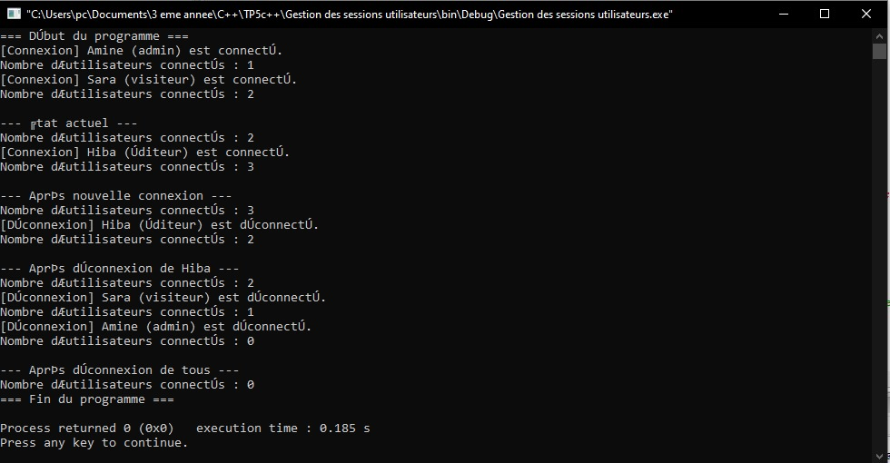

# TP5 — Attributs et Méthodes Statiques en C++

##  Cours : Programmation Orientée Objet (C++)

---

##  Objectif général
Ce TP a pour but d’approfondir la compréhension des **attributs** et **méthodes statiques** en C++, c’est-à-dire des éléments **communs à toutes les instances d’une classe**.  
Les exercices mettent en pratique :
- le partage de données entre objets ;
- la gestion de compteurs d’instances ;
- l’utilisation de constantes globales à l’échelle d’une classe.

---

##   Exercice 1 — Compteur d’objets

###  Objectif
Créer une classe capable de **compter automatiquement** combien d’objets ont été instanciés et détruits.

### Spécifications techniques
**Classe : `Boite`**

| Attribut | Type | Description |
|-----------|-------|-------------|
| `longueur` | `float` | Longueur de la boîte |
| `largeur` | `float` | Largeur de la boîte |
| `hauteur` | `float` | Hauteur de la boîte |
| `nbBoites` | `static int` | Compteur global de boîtes existantes |

**Méthodes :**
- **Constructeur :** initialise les attributs et incrémente `nbBoites`.
- **Destructeur :** décrémente `nbBoites`.
- **`static int getNombreBoites()` :** retourne le nombre actuel d’objets.

---
## Résultat visuel

  
<em>Figure 1</em>
 

##  Exercice 2 : Taux de TVA partagé
##  Objectif
Mettre en œuvre un **attribut statique** commun à tous les objets d’une même classe : ici le **taux de TVA** partagé entre tous les produits.

---

##  Spécifications techniques

### Classe : `Produit`

| Attribut | Type | Description |
|-----------|-------|-------------|
| `nom` | `string` | Nom du produit |
| `prixHT` | `float` | Prix hors taxe |
| `tauxTVA` | `static float` | Taux de TVA partagé par tous les produits (valeur par défaut : 20 %) |

### Méthodes
- **Constructeur** → initialise le nom et le prix HT.  
- **`float getPrixTTC()`** → renvoie le prix toutes taxes comprises.  
- **`static void modifierTVA(float nouveauTaux)`** → modifie le taux de TVA pour tous les produits.  
- **`void afficher()`** → affiche le nom et le prix TTC.  

---

---
## Résultat visuel

  
<em>Figure 2</em>
 

## Exercice 3 : Gestion des sessions utilisateurs

##  Objectif
Mettre en œuvre des **attributs** et **méthodes statiques** pour gérer un **état global partagé** :  
le nombre total d’utilisateurs connectés dans un système.

---

##  Spécifications techniques

### Classe : `Utilisateur`

| Attribut | Type | Description |
|-----------|-------|-------------|
| `nom` | `string` | Nom de l’utilisateur |
| `role` | `string` | Rôle de l’utilisateur (ex : `"admin"`, `"visiteur"`) |
| `nbUtilisateursConnectes` | `static int` | Nombre total d’utilisateurs connectés (partagé entre tous les objets) |

### Méthodes
- **Constructeur** → incrémente le compteur des utilisateurs connectés.  
- **Destructeur** → décrémente le compteur lors de la déconnexion (destruction d’un objet).  
- **`static int getNbUtilisateursConnectes()`** → retourne le nombre actuel d’utilisateurs connectés.  

## Résultat visuel

  
<em>Figure 3</em>
 

##  Environnement de travail

-Langage : C++17 ou supérieur

-IDE : Code::Blocks, Visual Studio Code, CLion ou Dev-C++

-Compilateur : g++ ou clang++
